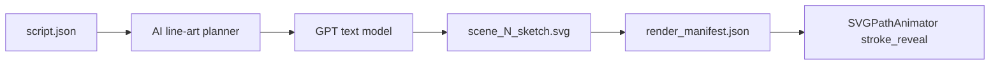

# AI-Generated Hand-Drawn Line Art (Per Scene)

## Can GPT generate hand-drawn line art?

**Yes — but the product depends on which API you use:**

| API | Output | Looks hand-drawn? | Stroke-dash animation? |
|-----|--------|-------------------|-------------------------|
| **Text model** (`gpt-4o` / `gpt-4o-mini`) | SVG markup (paths, lines, text) | Yes, if prompted for sketch style | **Yes** — existing [`SVGPathAnimator`](renderer/src/components/SVGPathAnimator.tsx) |
| **Image model** (`gpt-image-1-mini`, ~$0.005/img low) | PNG/WebP pixels | Yes | **No** — only wipe/fade unless you vectorize |

For your Newton example (box at rest → force applied → box moves + labels), a **text model** is the right fit: one scene prompt can describe the whole whiteboard frame, and GPT returns something like:

```xml
<svg viewBox="0 0 1920 1080" fill="none" stroke="#1a1a2e" stroke-width="2.5">
  <path d="..." data-path-length="120"/>  <!-- box A -->
  <path d="..." data-path-length="80"/>   <!-- person pushing -->
  <text>...</text>
</svg>
```

That is real “hand-drawn line art” your pipeline can **draw on** scene by scene.



**Recommendation:** Implement **GPT → SVG** as the primary `ai_line_art` mode. Keep **gpt-image-1-mini** as an optional later phase (raster sketch + wipe reveal) only if SVG quality is insufficient.

---

## Newton scene example (what GPT would be asked)

Per scene, prompt includes:

- Canvas: 1920×1080, white background, centered layout
- Style: educational whiteboard, **outline only**, round caps, no fills, no shading, no photorealism
- Scene 1 (first law): left — box on ground with “at rest” label; right — same box with arrow “force” and box shifted; short caption text
- Narration + `visual_description` from [`script.json`](backend/services/render_service.py) script step
- Constraint: 15–40 `<path>` elements max per scene (keeps render fast)
- Optional: `data-path-length` on each path for smoother dash timing ([`strokeReveal.ts`](renderer/src/animations/strokeReveal.ts))

---

## Architecture: new visual mode (library vs AI)

Add config flag (project + env):

- `visual_mode: "library"` (current default — [`svg_retriever`](backend/services/svg_retriever.py) + [`layout_engine`](backend/services/layout_engine.py))
- `visual_mode: "ai_line_art"` (new)

Branch in [`scene_planner.py`](backend/services/scene_planner.py) / [`render_service.run_full_pipeline`](backend/services/render_service.py):

```python
if config.visual_mode == "ai_line_art":
    scene_plans = await build_scene_plans_from_ai_sketch(project_id, script, topic)
else:
    scene_plans = await build_visual_scenes(...)  # existing
```

Existing script + voice + timeline + Remotion + FFmpeg steps stay the same.

---

## New backend modules

### 1. [`backend/prompts/line_art_prompt.py`](backend/prompts/line_art_prompt.py) (new)

- System: whiteboard director + **SVG author** (valid XML, single root `<svg>`, `viewBox="0 0 1920 1080"`, stroke-only)
- User: scene narration, visual_description, duration, topic, optional prior-scene summary for consistency
- Output JSON schema:

```json
{
  "scene_id": 1,
  "headline": "Newton's First Law",
  "elements": [
    {
      "id": "scene-sketch",
      "type": "svg",
      "animation": "stroke_reveal",
      "delay": 0.3,
      "duration": 6.0,
      "svg_markup": "<svg>...</svg>"
    },
    {
      "id": "scene-headline-1",
      "type": "label",
      "animation": "static",
      "text": "..."
    }
  ]
}
```

Or simpler v1: **one composite `svg_markup` per scene** + static headline via existing [`_scene_headline`](backend/services/layout_engine.py).

### 2. [`backend/services/ai_line_art_service.py`](backend/services/ai_line_art_service.py) (new)

- `generate_scene_svg(scene, topic, style) -> str`
- Calls `llm_service._chat_json` with **structured output** (reuse [`llm_service.py`](backend/services/llm_service.py))
- Post-process: sanitize SVG (strip scripts, enforce viewBox, inject default stroke if missing, cap path count)
- Save to `generated/projects/{id}/svgs/scene-{scene_id}-sketch.svg`

### 3. [`backend/services/ai_sketch_pipeline.py`](backend/services/ai_sketch_pipeline.py) (new)

- `build_scene_plans_from_ai_sketch(project_id, script, topic)`
- Parallel `asyncio.gather` per script scene (same pattern as [`plan_semantic_scenes`](backend/services/semantic_visual_planner.py))
- Build [`ScenePlanSchema`](backend/models/schemas.py): one main `svg` element (full scene art) + static headline
- Run [`enhance_scene_layout`](backend/utils/timing.py) for timing
- Write `scene_plans.json`, `ai_sketch_audit.json` (prompt hash, model, path count)

### 4. Config

[`backend/config.py`](backend/config.py):

- `openai_line_art_model: str = "gpt-4o-mini"` (cheapest **text** model that still draws coherent SVG; tunable)
- `visual_mode_default: str = "library"`

Optional later:

- `openai_image_model: str = "gpt-image-1-mini"`
- `openai_image_quality: str = "low"`

---

## Renderer (minimal changes)

- [`timeline_sync.py`](backend/services/timeline_sync.py): already loads `svg_path` / `svg_content` — no change if plans set `svg_path`
- [`WhiteboardCanvas`](renderer/src/components/WhiteboardCanvas.tsx): already routes `type: "svg"` → [`SVGAnimator`](renderer/src/components/SVGAnimator.tsx) → stroke reveal
- Large scene SVGs (40+ paths): reuse parallel stroke logic from [`ColoredDiagramStrokeAnimator`](renderer/src/components/ColoredDiagramStrokeAnimator.tsx) pattern OR single shared progress for all paths (faster, still “draws in”)

**v1 animation rule:** one shared `stroke_reveal` progress across all paths in `scene-*-sketch.svg` (avoids 40s stagger on complex scenes).

---

## Frontend

- Home / config: **Visual source** toggle — `Asset library` | `AI line art (GPT)`
- Pass `visual_mode` in [`GenerateScriptRequest`](backend/models/schemas.py) / `config.json`
- Project viewer: show `ai_sketch_audit.json` and preview `scene-N-sketch.svg`

---

## Cost (rough, 8 scenes / 60s video)

| Approach | Est. cost |
|----------|-----------|
| **gpt-4o-mini** SVG per scene × 8 | ~$0.02–0.08 (text tokens; no image API) |
| **gpt-image-1-mini** low × 8 | ~$0.04 (@ ~$0.005/image) |
| **gpt-4o** SVG × 8 | Higher quality, ~$0.15–0.40 |

Cheapest **animatable** line art: **gpt-4o-mini → SVG**, not image API.

---

## Risks and mitigations

| Risk | Mitigation |
|------|------------|
| Invalid / huge SVG from LLM | Strict JSON schema; sanitize; max paths; retry once |
| Inconsistent style across scenes | Shared style preamble + “same stroke width and palette as prior scenes” in prompt |
| Text in SVG not stroke-animated | Headlines as separate `label` elements (static/fade), same as today |
| Slow Remotion on 100+ paths | Cap paths; shared progress; optional simplify pass |

---

## Out of scope (v1)

- Replacing photosynthesis / `single_diagram` template path
- Auto-vectorizing `gpt-image-1-mini` PNGs
- Multi-image sequences per scene (box state A then B as two PNGs) — v2 if needed
- Removing asset library mode

---

## Implementation order

1. Config + `visual_mode` branch in pipeline
2. `line_art_prompt.py` + `ai_line_art_service.py` (generate + sanitize SVG)
3. `ai_sketch_pipeline.py` → `ScenePlanSchema`
4. Renderer: shared-progress stroke for large scene SVGs
5. Frontend toggle + audit preview
6. README section: library vs AI line art vs (future) image API
