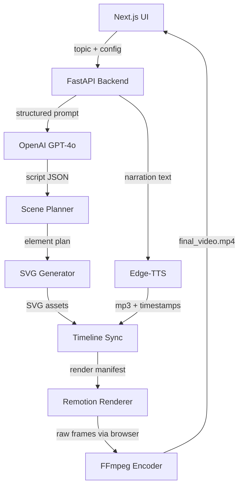
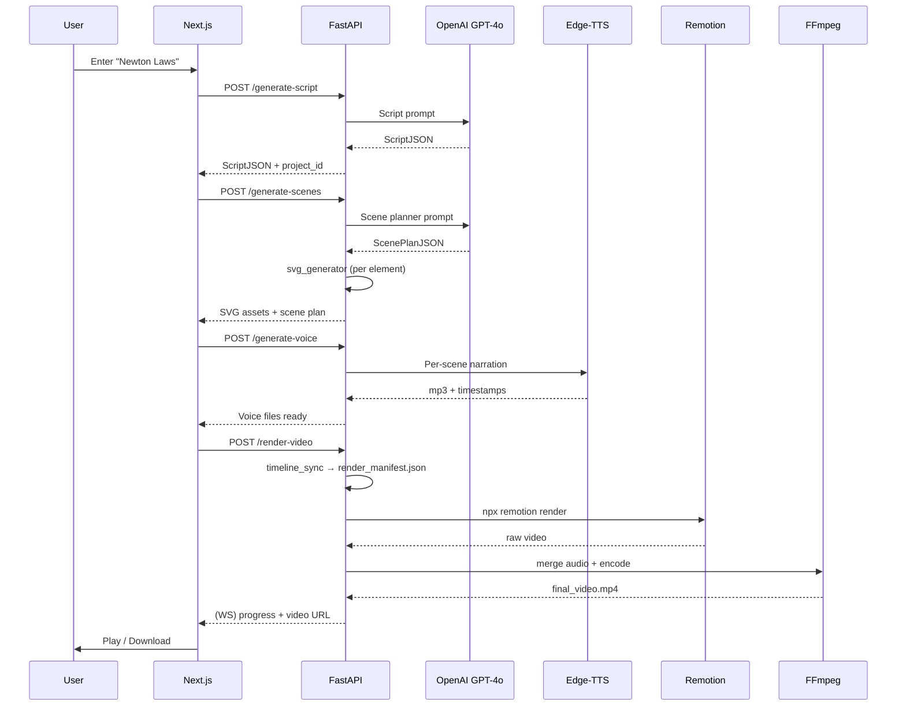

# AI Educational Whiteboard Video Generator

## System Overview



## Environment Notes

- **Python 3.9.6** is available (not 3.11 — all code will target 3.9+)
- **Node v24 / npm 11** available
- **FFmpeg** available at `/opt/homebrew/bin/ffmpeg`

---

## Folder Structure

```
animate_whiteboard/
├── frontend/                  # Next.js 14 + TypeScript + Tailwind + shadcn
├── backend/                   # FastAPI + Python 3.9
│   ├── api/routes/            # REST endpoints
│   ├── services/              # Business logic modules
│   ├── prompts/               # LLM prompt templates
│   ├── models/                # Pydantic schemas
│   └── utils/                 # File manager, job queue
├── renderer/                  # Remotion project (React + TypeScript)
│   └── src/
│       ├── compositions/      # WhiteboardVideo.tsx (root)
│       ├── components/        # Scene, SVGAnimator, CameraMotion, Subtitles
│       ├── animations/        # strokeReveal, transitions, highlights
│       └── types/
├── assets/
│   └── svg-templates/         # arrows, shapes, characters, icons
├── generated/
│   └── projects/{id}/         # per-project: script, svgs, voices, videos
├── .env.example
└── README.md
```

---

## Backend Architecture (`backend/`)

### API Routes

- `POST /generate-script` — LLM generates `ScriptSchema` JSON
- `POST /generate-scenes` — Scene planner produces `ScenePlanSchema` JSON
- `POST /generate-svg` — SVG engine returns asset files per scene
- `POST /generate-voice` — Edge-TTS returns mp3 + word timestamps
- `POST /render-video` — Orchestrates full pipeline; returns job_id
- `GET /project/{id}` — Fetch project state + artifacts
- `WS /ws/{job_id}` — WebSocket streaming of render progress

### Core Services

**`services/llm_service.py`**
- Uses `openai` Python SDK with `gpt-4o` as the default model
- Leverages OpenAI **structured outputs** (`response_format={"type": "json_object"}`) for reliable JSON
- Retry/validation on malformed responses — produces:
```json
{
  "title": "Newton's Laws of Motion",
  "total_duration": 60,
  "scenes": [
    {
      "scene_id": 1,
      "narration": "...",
      "visual_description": "...",
      "keywords": ["inertia", "force"],
      "duration": 12
    }
  ]
}
```

**`services/scene_planner.py`**
- Second LLM call with visual-specific prompt
- Converts narration + `visual_description` → structured element list:
```json
{
  "scene_id": 1,
  "background": "white",
  "elements": [
    {
      "id": "car-1",
      "type": "svg_shape",
      "shape": "car",
      "position": {"x": 200, "y": 300},
      "size": {"w": 120, "h": 60},
      "animation": "stroke_reveal",
      "delay": 0.5,
      "duration": 2.0,
      "label": "Moving Car"
    },
    {
      "id": "arrow-1",
      "type": "arrow",
      "from": {"x": 320, "y": 330},
      "to": {"x": 500, "y": 330},
      "animation": "stroke_reveal",
      "delay": 2.5,
      "label": "Velocity"
    }
  ]
}
```

**`services/svg_generator.py`**
- Template library for common shapes: car, human, cell, atom, arrow, flowchart-box, flask, DNA, circuit
- Uses `roughpy` or manual jitter algorithm to add hand-drawn appearance
- Generates per-element SVG files into `generated/projects/{id}/svgs/`
- Each SVG path includes `data-path-length` attribute for animation

**`services/voice_service.py`**
- `edge-tts` async call per scene narration
- Outputs `scene_{n}.mp3` to `generated/projects/{id}/voices/`
- Generates word-level timestamps from `edge-tts` SSML boundary events
- Produces `scene_{n}_timestamps.json`

**`services/timeline_sync.py`**
- Aligns SVG element `delay/duration` to voice timestamps
- Produces final `render_manifest.json` consumed by Remotion:
```json
{
  "fps": 30,
  "width": 1920,
  "height": 1080,
  "scenes": [
    {
      "scene_id": 1,
      "start_frame": 0,
      "duration_frames": 360,
      "audio": "voices/scene_1.mp3",
      "subtitles": [...],
      "elements": [...]
    }
  ]
}
```

**`services/render_service.py`**
- Writes `render_manifest.json` to `generated/projects/{id}/`
- Runs `npx remotion render` as subprocess with progress streaming via WebSocket
- Calls FFmpeg to merge audio tracks and encode final MP4

---

## Renderer Architecture (`renderer/`)

### `src/compositions/WhiteboardVideo.tsx`
- Root Remotion composition; reads `RENDER_MANIFEST` env var pointing to manifest JSON
- Loops scenes, delegates to `<Scene>`

### `src/components/Scene.tsx`
- Sets up camera spring, renders `<WhiteboardCanvas>` and `<SubtitleRenderer>`

### `src/components/SVGAnimator.tsx`
- Core animation primitive
- For each SVG path: computes `pathLength`, animates `strokeDashoffset` from `pathLength → 0` via `interpolate`
- Supports: `stroke_reveal`, `fade_in`, `scale_in`, `highlight`

```tsx
// Key animation logic
const progress = interpolate(frame, [startFrame, endFrame], [0, 1], {
  extrapolateLeft: 'clamp', extrapolateRight: 'clamp',
  easing: Easing.bezier(0.4, 0, 0.2, 1),
});
const dashOffset = pathLength * (1 - progress);
```

### `src/components/CameraMotion.tsx`
- Spring-based pan/zoom using `spring()` and CSS `transform`
- Auto-focuses on primary scene element

### `src/components/SubtitleRenderer.tsx`
- Renders highlighted word-by-word subtitles synchronized to audio timestamps

### `src/animations/strokeReveal.ts`
- Utility: compute total path length, sequence multiple paths with stagger delays
- Highlight animation: colored `rect` underline reveal

---

## Frontend Architecture (`frontend/`)

### Pages

- **`/` (Home)** — Topic input, style selector (whiteboard/minimal/colorful), voice picker (male/female), duration slider, "Generate Video" CTA
- **`/project/[id]`** — Scene cards with SVG preview, audio waveform, timeline visualization, render button
- **`/render/[id]`** — Live progress tracker via WebSocket, log output, final video player + download

### Key Components

- `TopicInput.tsx` — Animated search bar, example topics, validation
- `SceneCard.tsx` — Per-scene preview with SVG thumbnail, narration text, duration badge
- `ProgressTracker.tsx` — Step-by-step pipeline progress (Script → Scenes → SVGs → Voice → Render)
- `VideoPreview.tsx` — HTML5 video player with fullscreen + download
- `TimelineView.tsx` — Horizontal timeline showing scenes, audio, element timing

### API Client (`lib/api.ts`)
- Typed fetch wrapper for all endpoints
- WebSocket hook for render progress

---

## Data Flow: End-to-End



---

## Key Configuration Files

- **`.env.example`** — `OPENAI_API_KEY`, `OPENAI_MODEL=gpt-4o`, `FFMPEG_PATH`, `PORT`
- **`backend/requirements.txt`** — `fastapi`, `uvicorn`, `openai`, `edge-tts`, `aiofiles`, `python-multipart`, `websockets`, `pydantic`
- **`renderer/package.json`** — `remotion`, `@remotion/renderer`, `roughjs`, `react`, `typescript`
- **`frontend/package.json`** — `next`, `tailwindcss`, `shadcn-ui`, `lucide-react`, `framer-motion`

---

## Performance Strategy

- SVG animated in-browser via Remotion (no PIL/OpenCV frame loops)
- Remotion uses headless Chromium for GPU-accelerated rendering
- Edge-TTS runs async concurrently for all scenes
- LLM calls for scene planning run in parallel per-scene via `asyncio.gather`
- FFmpeg single-pass `-c:v libx264 -preset fast -crf 20` encoding
- Final render: ~60s video takes ~2-4 min locally (GPU concurrency via `--concurrency` flag)

---

## Implementation Order

1. Project scaffolding + env setup
2. Backend: models, LLM service, script generation API
3. Backend: scene planner + SVG generator (template library)
4. Backend: Edge-TTS voice service + timeline sync
5. Renderer: Remotion project setup + SVGAnimator + Scene components
6. Backend: render_service orchestrating Remotion + FFmpeg
7. Frontend: Home page + API client
8. Frontend: Project viewer + render progress + video preview
9. SVG template library (arrows, shapes, characters, icons)
10. Integration testing + README
